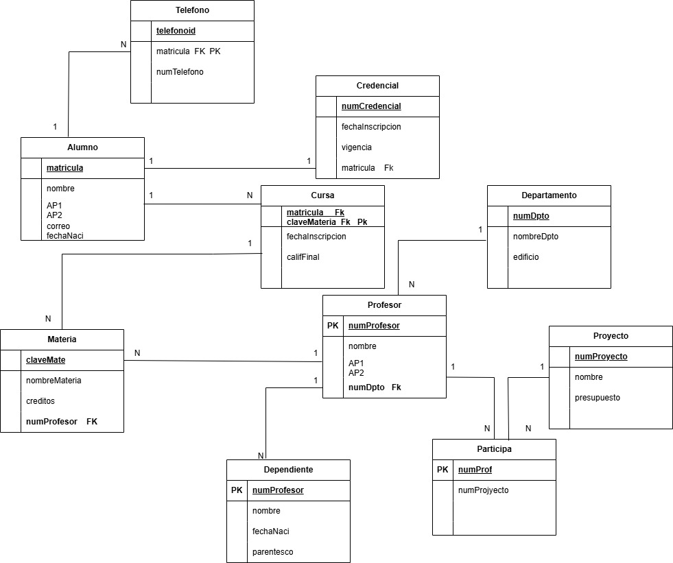

# Diccionario de datos de la BD del Sistema de gestion Academica

# DICCIONARIO DE DATOS

# Sistema de Base de Datos

## Información General 

| Campo | Descripción |
|--------|-------------|
| Nombre del sistema | Sistema de Gestión Académica |
| Tipo | Base de Datos Relacional |
| Motor sugerido | MySQL 8.0 |
| Modelo | Relacional |
| Normalización | Hasta 3FN |

---

# Descripción del Sistema

El sistema administra la información de alumnos, profesores, materias, departamentos, proyectos, credenciales, teléfonos y dependientes.

Permite registrar:

- Alumnos
- Profesores
- Materias
- Inscripciones
- Departamentos
- Proyectos
- Participaciones
- Credenciales
- Teléfonos
- Dependientes

Toda la información se encuentra normalizada para evitar redundancia y garantizar la integridad referencial.

---

# Catálogo de Restricciones Utilizadas

## Llaves Primarias (PRIMARY KEY)

- Alumno(matricula)
- Profesor(numProfesor)
- Materia(claveMate)
- Departamento(numDpto)
- Proyecto(numProyecto)
- Credencial(numCredencial)
- Telefono(telefonoid)
- Dependiente(numProfesor)
- Participa(numProf)

---

## Llaves Foráneas (FOREIGN KEY)

| Relación | Tipo | Descripción |
| :--- | :---: | :--- |
| Telefono - Alumno | 1:N | Un alumno puede tener varios teléfonos. |
| Credencial - Alumno | 1:1 | Un alumno tiene una credencial. |
| Profesor - Materia | 1:N | Un profesor puede impartir varias materias. |
| Departamento - Profesor | 1:N | Un departamento puede tener varios profesores. |
| Alumno - Cursa | 1:N | Un alumno puede cursar varias materias. |
| Materia - Cursa | 1:N | Una materia puede ser cursada por varios alumnos. |
| Profesor - Participa | 1:N | Un profesor puede participar en varios proyectos. |
| Proyecto - Participa | 1:N | Un proyecto puede contar con varios profesores. |
| Profesor - Dependiente | 1:N | Un profesor puede tener varios dependientes. |

---

## Restricciones NOT NULL

Todos los campos PK

Todas las FK

Nombre

Apellido

NombreMateria

NombreProyecto

NombreDepartamento

---

## Restricciones UNIQUE

- matrícula
- numProfesor
- claveMateria
- numProyecto
- numCredencial

---

## Restricciones CHECK

Calificación entre 0 y 100

Créditos mayores a 0

Presupuesto mayor a 0

FechaNacimiento menor a la fecha actual

---

# Diccionario de Datos

---

# Tabla: Alumno

| Campo | Tipo | Longitud | Descripción |
|--------|------|----------|-------------|
| matricula | VARCHAR | 10 | Identificador del alumno |
| nombre | VARCHAR | 50 | Nombre |
| AP1 | VARCHAR | 50 | Primer apellido |
| AP2 | VARCHAR | 50 | Segundo apellido |
| correo | VARCHAR | 100 | Correo electrónico |
| fechaNaci | DATE | - | Fecha de nacimiento |

---

# Tabla: Telefono

| Campo | Tipo | Descripción |
|--------|------|-------------|
| telefonoid | INT | Identificador |
| matricula | VARCHAR(10) | Alumno propietario |
| numTelefono | VARCHAR(15) | Número telefónico |
---

# Tabla: Credencial

| Campo | Tipo | Descripción |
|--------|------|-------------|
| numCredencial | INT | Número de credencial |
| fechaInscripcion | DATE | Fecha de inscripción |
| vigencia | DATE | Fecha de vencimiento |
| matricula | VARCHAR(10) | Alumno |

---

# Tabla: Materia

| Campo | Tipo | Descripción |
|--------|------|-------------|
| claveMate | VARCHAR(10) | Clave de materia |
| nombreMateria | VARCHAR(100) | Nombre |
| creditos | INT | Créditos |
| numProfesor | INT | Profesor encargado |

---

# Tabla: Cursa

| Campo | Tipo | Descripción |
|--------|------|-------------|
| matricula | VARCHAR(10) | Alumno |
| claveMateria | VARCHAR(10) | Materia |
| fechaInscripcion | DATE | Fecha inscripción |
| califFinal | DECIMAL(5,2) | Calificación final |

---

# Tabla: Profesor

| Campo | Tipo | Descripción |
|--------|------|-------------|
| numProfesor | INT | Profesor |
| nombre | VARCHAR(50) | Nombre |
| AP1 | VARCHAR(50) | Apellido paterno |
| AP2 | VARCHAR(50) | Apellido materno |
| numDpto | INT | Departamento |

---

# Tabla: Departamento

| Campo | Tipo | Descripción |
|--------|------|-------------|
| numDpto | INT | Departamento |
| nombreDpto | VARCHAR(80) | Nombre |
| edificio | VARCHAR(30) | Edificio |

---

# Tabla: Proyecto

| Campo | Tipo | Descripción |
|--------|------|-------------|
| numProyecto | INT | Proyecto |
| nombre | VARCHAR(80) | Nombre |
| presupuesto | DECIMAL(12,2) | Presupuesto |

---

# Tabla: Participa

| Campo | Tipo | Descripción |
|--------|------|-------------|
| numProf | INT | Profesor |
| numProyecto | INT | Proyecto |

---

# Tabla: Dependiente

| Campo | Tipo | Descripción |
|--------|------|-------------|
| numProfesor | INT | Profesor |
| nombre | VARCHAR(80) | Nombre |
| fechaNaci | DATE | Fecha nacimiento |
| parentesco | VARCHAR(30) | Parentesco |

---

# Relaciones de la Base de Datos

| Tabla Padre | Tabla Hija | Relación |
|--------------|------------|-----------|
| Alumno | Teléfono | 1:N |
| Alumno | Credencial | 1:1 |
| Alumno | Cursa | 1:N |
| Materia | Cursa | 1:N |
| Profesor | Materia | 1:N |
| Departamento | Profesor | 1:N |
| Profesor | Dependiente | 1:N |
| Profesor | Participa | 1:N |
| Proyecto | Participa | 1:N |

---

# Matriz de Claves Foráneas

| Tabla | Llave Foránea | Referencia |
|--------|---------------|------------|
| Telefono | matricula | Alumno |
| Credencial | matricula | Alumno |
| Cursa | matricula | Alumno |
| Cursa | claveMateria | Materia |
| Materia | numProfesor | Profesor |
| Profesor | numDpto | Departamento |
| Participa | numProf | Profesor |
| Participa | numProyecto | Proyecto |
| Dependiente | numProfesor | Profesor |

---

# Integridad Referencial

- No puede existir un teléfono sin alumno.
- No puede existir una credencial sin alumno.
- No puede existir una materia sin profesor.
- No puede existir un profesor sin departamento.
- No puede existir una inscripción sin alumno y materia.
- No puede existir un dependiente sin profesor.
- No puede existir una participación sin profesor ni proyecto.

---

# Reglas de Negocio

1. Un alumno puede tener varios teléfonos.
2. Un alumno únicamente posee una credencial.
3. Un alumno puede cursar muchas materias.
4. Una materia puede ser cursada por muchos alumnos.
5. Cada materia tiene un profesor responsable.
6. Un profesor pertenece a un departamento.
7. Un profesor puede participar en varios proyectos.
8. Un proyecto puede tener varios profesores.
9. Un profesor puede registrar varios dependientes.
10. La calificación final debe estar entre 0 y 100.
11. Los créditos de una materia deben ser mayores que cero.
12. El presupuesto de un proyecto debe ser mayor que cero.

# Modelo Relacional
