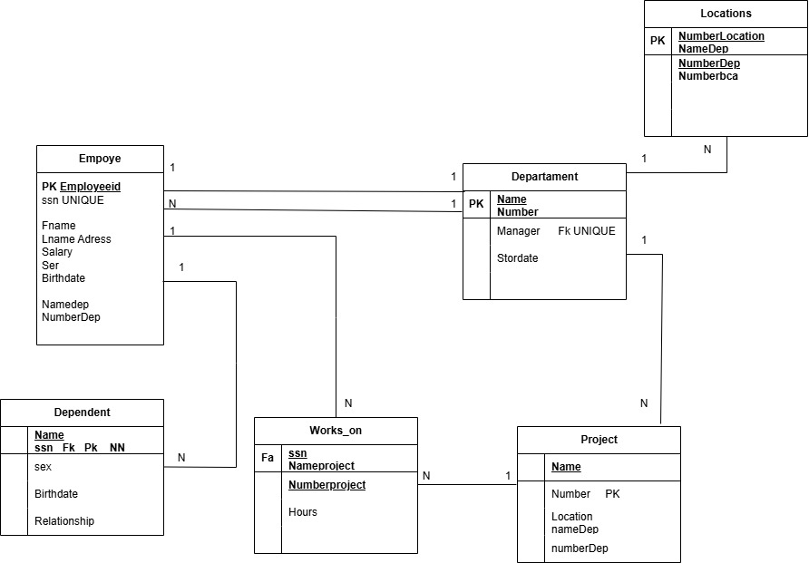

# Descripción del Sistema

El sistema administra la información de los empleados, departamentos, proyectos, ubicaciones, dependientes y las horas que cada empleado dedica a los proyectos de la empresa.

Permite:

- Registrar empleados.
- Administrar departamentos.
- Asignar gerentes a departamentos.
- Registrar proyectos.
- Registrar las ubicaciones de los departamentos.
- Registrar dependientes de los empleados.
- Controlar las horas trabajadas por empleado en cada proyecto.

---

# Catálogo de Restricciones Utilizadas

## PRIMARY KEY

- Employee(EmployeeID)
- Department(Number)
- Project(Number)
- Locations(NumberLocation)
- Dependent(Name, ssn)
- Works_on(ssn, NumberProject)

---

## FOREIGN KEY

Employee.NumberDep → Department.Number
- Department.Manager → Employee.EmployeeID
- Project.NumberDep → Department.Number
- Locations.NumberDep → Department.Number
- Dependent.ssn → Employee.EmployeeID
- Works_on.ssn → Employee.EmployeeID
- Works_on.NumberProject → Project.Number

## UNIQUE

- Employee.ssn
- Department.Manager

---

## NOT NULL

Todos los campos PK

Todos los campos FK

Nombre

Apellido

Salario

Fecha de nacimiento

Nombre del departamento

Nombre del proyecto

# Diccionario de Datos

---

# Tabla: Employee

| Campo | Tipo | Longitud | PK | FK | Nulo | Descripción |
|--------|------|----------|----|----|-------|-------------|
| EmployeeID | INT | - | Sí | No | No | Identificador del empleado |
| ssn | VARCHAR | 20 | No | No | No | Número de seguridad social |
| Fname | VARCHAR | 50 | No | No | No | Nombre |
| Lname | VARCHAR | 50 | No | No | No | Apellido |
| Address | VARCHAR | 150 | No | No | Sí | Dirección |
| Salary | DECIMAL | 10,2 | No | No | No | Salario |
| Sex | CHAR | 1 | No | No | No | Sexo |
| Birthdate | DATE | - | No | No | No | Fecha de nacimiento |
| NameDep | VARCHAR | 60 | No | No | Sí | Nombre del departamento |
| NumberDep | INT | - | No | Sí | No | Departamento |

---

# Tabla: Department

| Campo | Tipo | PK | FK | Descripción |
|--------|------|----|----|-------------|
| Number | INT | Sí | No | Número del departamento |
| Name | VARCHAR(80) | No | No | Nombre |
| Manager | INT | No | Sí | Gerente responsable |
| StartDate | DATE | No | No | Fecha de inicio del gerente |

---

# Tabla: Locations

| Campo | Tipo | PK | FK | Descripción |
|--------|------|----|----|-------------|
| NumberLocation | INT | Sí | No | Identificador de ubicación |
| NameDep | VARCHAR(80) | No | No | Nombre del departamento |
| NumberDep | INT | No | Sí | Departamento |
| NumberBCA | VARCHAR(20) | No | No | Código de ubicación |

---

# Tabla: Project

| Campo | Tipo | PK | FK | Descripción |
|--------|------|----|----|-------------|
| Number | INT | Sí | No | Número del proyecto |
| Name | VARCHAR(80) | No | No | Nombre del proyecto |
| Location | VARCHAR(80) | No | No | Ubicación |
| NameDep | VARCHAR(80) | No | No | Departamento responsable |
| NumberDep | INT | No | Sí | Departamento |

---

# Tabla: Dependent

| Campo | Tipo | PK | FK | Descripción |
|--------|------|----|----|-------------|
| Name | VARCHAR(80) | Sí | No | Nombre del dependiente |
| ssn | VARCHAR(20) | Sí | Sí | Empleado propietario |
| Sex | CHAR(1) | No | No | Sexo |
| Birthdate | DATE | No | No | Fecha de nacimiento |
| Relationship | VARCHAR(40) | No | No | Parentesco |

---

# Tabla: Works_on

| Campo | Tipo | PK | FK | Descripción |
|--------|------|----|----|-------------|
| ssn | VARCHAR(20) | Sí | Sí | Empleado |
| NumberProject | INT | Sí | Sí | Proyecto |
| Hours | DECIMAL(5,2) | No | No | Horas trabajadas |

---

# Relaciones de la Base de Datos

| Tabla Padre | Tabla Hija | Relación |
|--------------|------------|-----------|
| Department | Employee | 1:N |
| Employee | Department | 1:1 (Gerente) |
| Department | Project | 1:N |
| Department | Locations | 1:N |
| Employee | Dependent | 1:N |
| Employee | Works_on | 1:N |
| Project | Works_on | 1:N |

---

# Matriz de Claves Foráneas

| Tabla | Llave Foránea | Referencia |
|--------|---------------|------------|
| Employee | NumberDep | Department.Number |
| Department | Manager | Employee.EmployeeID |
| Project | NumberDep | Department.Number |
| Locations | NumberDep | Department.Number |
| Dependent | ssn | Employee.EmployeeID |
| Works_on | ssn | Employee.EmployeeID |
| Works_on | NumberProject | Project.Number |

---

# Integridad Referencial

- No puede existir un empleado sin un departamento asignado.
- Todo departamento debe tener un gerente registrado.
- Un proyecto debe pertenecer a un departamento existente.
- Una ubicación debe estar asociada a un departamento existente.
- Un dependiente debe pertenecer a un empleado registrado.
- Un registro de Works_on debe asociar un empleado existente con un proyecto existente.
- No se puede eliminar un departamento si existen empleados, proyectos o ubicaciones relacionadas.
- No se puede eliminar un empleado si administra un departamento o tiene registros relacionados sin antes actualizar dichas referencias.

---

# Reglas de Negocio

1. Cada empleado pertenece a un único departamento.
2. Un departamento puede tener varios empleados.
3. Cada departamento tiene un solo gerente.
4. Un empleado puede administrar como máximo un departamento.
5. Un departamento puede desarrollar varios proyectos.
6. Cada proyecto pertenece a un solo departamento.
7. Un departamento puede tener varias ubicaciones.
8. Un empleado puede registrar varios dependientes.
9. Un empleado puede trabajar en varios proyectos.
10. Un proyecto puede tener asignados varios empleados.
11. Las horas trabajadas en un proyecto no pueden ser negativas.
12. El salario del empleado debe ser mayor que cero.
13. La fecha de nacimiento del empleado debe ser anterior a la fecha actual.
14. El gerente de un departamento debe ser un empleado registrado en la empresa.

# Modelo Relacional
