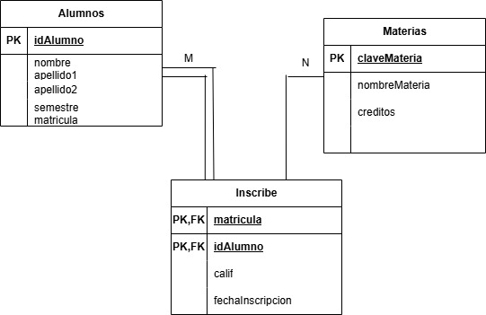

# Descripción del Sistema

El sistema administra la información de los alumnos, las materias ofertadas y las inscripciones realizadas. También permite almacenar la calificación obtenida por cada alumno y la fecha en que se realizó la inscripción.

---

# Catálogo de Restricciones Utilizadas

## Llaves Primarias

- Alumnos(idAlumno)
- Materias(claveMateria)
- Inscribe(matricula, idAlumno)

## Llaves Foráneas

- Inscribe.idAlumno → Alumnos.idAlumno
- Inscribe.matricula → Materias.claveMateria

## Restricciones CHECK

- Calificación entre 0 y 100.
- Créditos mayores que 0.
- Semestre mayor que 0.

---

# Diccionario de Datos

## Tabla: Alumnos

| Campo | Tipo | Descripción |
|--------|------|-------------|
| idAlumno | INT | Identificador único del alumno |
| nombre | VARCHAR(50) | Nombre del alumno |
| apellido1 | VARCHAR(50) | Primer apellido |
| apellido2 | VARCHAR(50) | Segundo apellido |
| semestre | INT | Semestre que cursa el alumno |
| matricula | VARCHAR(15) | Matrícula escolar |

---

## Tabla: Materias

| Campo | Tipo | Descripción |
|--------|------|-------------|
| claveMateria | VARCHAR(15) | Clave de la materia |
| nombreMateria | VARCHAR(80) | Nombre de la materia |
| creditos | INT | Número de créditos |

---

## Tabla: Inscribe

| Campo | Tipo | Descripción |
|--------|------|-------------|
| matricula | VARCHAR(15) | Clave de la materia inscrita |
| idAlumno | INT | Alumno inscrito |
| calif | DECIMAL(5,2) | Calificación obtenida |
| fechaInscripcion | DATE | Fecha de inscripción |

---

# Relaciones en la Base de Datos

| Tabla Padre | Tabla Hija | Cardinalidad |
|--------------|------------|--------------|
| Alumnos | Inscribe | 1 : N |
| Materias | Inscribe | 1 : N |

La relación entre **Alumnos** y **Materias** es de **Muchos a Muchos (M:N)** y se resuelve mediante la tabla **Inscribe**.

---

# Matriz de Claves Foráneas

| Tabla | Llave Foránea | Referencia |
|--------|---------------|------------|
| Inscribe | idAlumno | Alumnos.idAlumno |
| Inscribe | matricula | Materias.claveMateria |

---

# Integridad Referencial

- No puede existir una inscripción sin un alumno registrado.
- No puede existir una inscripción para una materia inexistente.
- No se puede eliminar un alumno si tiene inscripciones registradas.
- No se puede eliminar una materia mientras existan alumnos inscritos en ella.
- Cada registro de la tabla **Inscribe** debe corresponder a un alumno y una materia existentes.

---

# Reglas de Negocio

1. Un alumno puede inscribirse en varias materias.
2. Una materia puede ser cursada por varios alumnos.
3. Un alumno no puede inscribirse dos veces en la misma materia durante el mismo periodo.
4. Toda inscripción debe registrar la fecha en que fue realizada.
5. La calificación debe estar comprendida entre 0 y 100.
6. Los créditos de una materia deben ser mayores que cero.
7. Todo alumno debe pertenecer al menos a un semestre.
8. Cada materia debe contar con una clave única.
9. Cada alumno debe tener un identificador único.
10. La relación entre alumnos y materias se administra mediante la tabla **Inscribe**.
----

# Modelo relacional

