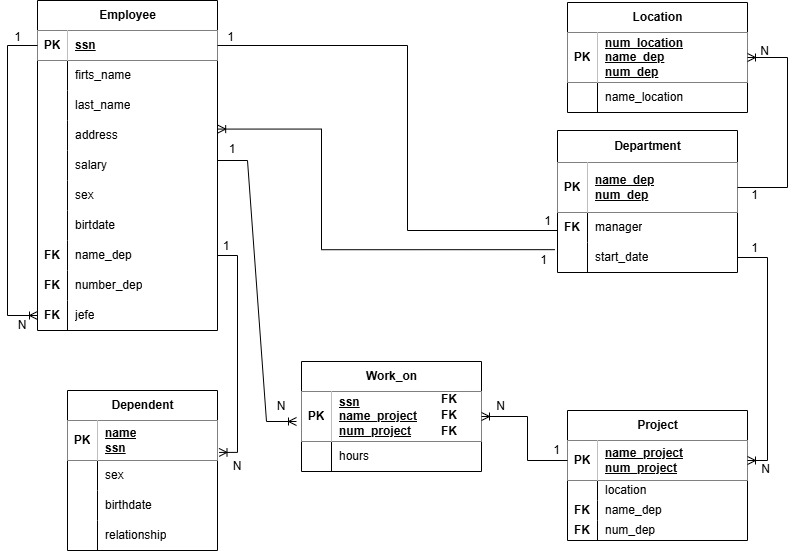

# Descripción del Sistema

El sistema administra la información de los empleados, departamentos, ubicaciones, proyectos y dependientes. También permite registrar las horas que cada empleado trabaja en los diferentes proyectos de la empresa, manteniendo la integridad de la estructura organizacional.

---

# Catálogo de Restricciones Utilizadas

## Llaves Primarias

- Employee(ssn)
- Department(name_dep, num_dep)
- Location(num_location, name_dep, num_dep)
- Project(name_project, num_project)
- Dependent(name, ssn)
- Work_on(ssn, name_project, num_project)

## Llaves Foráneas

- Employee.name_dep → Department.name_dep
- Employee.number_dep → Department.num_dep
- Employee.jefe → Employee.ssn
- Department.manager → Employee.ssn
- Location.name_dep → Department.name_dep
- Location.num_dep → Department.num_dep
- Project.name_dep → Department.name_dep
- Project.num_dep → Department.num_dep
- Dependent.ssn → Employee.ssn
- Work_on.ssn → Employee.ssn
- Work_on.name_project → Project.name_project
- Work_on.num_project → Project.num_project

## Restricciones UNIQUE

- ssn
- num_dep
- num_project
- num_location

## Restricciones CHECK

- salary > 0
- hours >= 0
- birthdate < CURRENT_DATE
- start_date <= CURRENT_DATE

---

# Diccionario de Datos

## Tabla: Employee

| Campo | Tipo | Descripción |
|--------|------|-------------|
| ssn | VARCHAR(20) | Número de seguro social del empleado |
| first_name | VARCHAR(50) | Nombre del empleado |
| last_name | VARCHAR(50) | Apellido del empleado |
| address | VARCHAR(150) | Dirección |
| salary | DECIMAL(10,2) | Salario |
| sex | CHAR(1) | Sexo |
| birthdate | DATE | Fecha de nacimiento |
| name_dep | VARCHAR(60) | Nombre del departamento |
| number_dep | INT | Número del departamento |
| jefe | VARCHAR(20) | Supervisor del empleado |

---

## Tabla: Department

| Campo | Tipo | Descripción |
|--------|------|-------------|
| name_dep | VARCHAR(60) | Nombre del departamento |
| num_dep | INT | Número del departamento |
| manager | VARCHAR(20) | Gerente responsable |
| start_date | DATE | Fecha de inicio del gerente |

---

## Tabla: Location

| Campo | Tipo | Descripción |
|--------|------|-------------|
| num_location | INT | Identificador de la ubicación |
| name_dep | VARCHAR(60) | Nombre del departamento |
| num_dep | INT | Número del departamento |
| name_location | VARCHAR(80) | Nombre de la ubicación |

---

## Tabla: Project

| Campo | Tipo | Descripción |
|--------|------|-------------|
| name_project | VARCHAR(80) | Nombre del proyecto |
| num_project | INT | Número del proyecto |
| location | VARCHAR(80) | Ubicación del proyecto |
| name_dep | VARCHAR(60) | Departamento responsable |
| num_dep | INT | Número del departamento responsable |

---

## Tabla: Dependent

| Campo | Tipo | Descripción |
|--------|------|-------------|
| name | VARCHAR(80) | Nombre del dependiente |
| ssn | VARCHAR(20) | Empleado al que pertenece |
| sex | CHAR(1) | Sexo |
| birthdate | DATE | Fecha de nacimiento |
| relationship | VARCHAR(40) | Parentesco con el empleado |

---

## Tabla: Work_on

| Campo | Tipo | Descripción |
|--------|------|-------------|
| ssn | VARCHAR(20) | Empleado asignado |
| name_project | VARCHAR(80) | Nombre del proyecto |
| num_project | INT | Número del proyecto |
| hours | DECIMAL(5,2) | Horas trabajadas |

---

# Relaciones en la Base de Datos

| Tabla Padre | Tabla Hija | Cardinalidad |
|--------------|------------|--------------|
| Department | Employee | 1 : N |
| Employee | Employee | 1 : N (Supervisor) |
| Department | Location | 1 : N |
| Department | Project | 1 : N |
| Employee | Dependent | 1 : N |
| Employee | Work_on | 1 : N |
| Project | Work_on | 1 : N |

---

# Matriz de Claves Foráneas

| Tabla | Llave Foránea | Referencia |
|--------|---------------|------------|
| Employee | name_dep | Department.name_dep |
| Employee | number_dep | Department.num_dep |
| Employee | jefe | Employee.ssn |
| Department | manager | Employee.ssn |
| Location | name_dep | Department.name_dep |
| Location | num_dep | Department.num_dep |
| Project | name_dep | Department.name_dep |
| Project | num_dep | Department.num_dep |
| Dependent | ssn | Employee.ssn |
| Work_on | ssn | Employee.ssn |
| Work_on | name_project | Project.name_project |
| Work_on | num_project | Project.num_project |

---

# Integridad Referencial

- Todo empleado debe pertenecer a un departamento existente.
- Un supervisor debe ser un empleado registrado.
- Cada departamento debe tener un gerente registrado.
- Toda ubicación debe estar asociada a un departamento existente.
- Todo proyecto debe pertenecer a un departamento existente.
- Un dependiente debe estar asociado a un empleado registrado.
- Todo registro en **Work_on** debe corresponder a un empleado y un proyecto existentes.
- No se puede eliminar un departamento si tiene empleados, proyectos o ubicaciones asociadas.
- No se puede eliminar un empleado que sea gerente, supervisor o tenga dependientes y proyectos asignados sin actualizar primero las referencias.

---

# Reglas de Negocio

1. Un empleado pertenece a un solo departamento.
2. Un departamento puede tener varios empleados.
3. Cada departamento tiene un único gerente.
4. Un empleado puede supervisar a varios empleados.
5. Un empleado solo tiene un supervisor directo.
6. Un departamento puede administrar varios proyectos.
7. Un departamento puede tener varias ubicaciones.
8. Un empleado puede registrar varios dependientes.
9. Un empleado puede participar en varios proyectos.
10. Un proyecto puede tener asignados varios empleados.
11. Las horas trabajadas deben ser mayores o iguales a cero.
12. El salario del empleado debe ser mayor que cero.
13. La fecha de nacimiento debe ser anterior a la fecha actual.
14. El gerente debe pertenecer a la empresa.
15. Un proyecto siempre debe estar asociado a un departamento.
16. No puede existir un registro de trabajo sin un empleado y un proyecto válidos.

# Modelo Relacional

