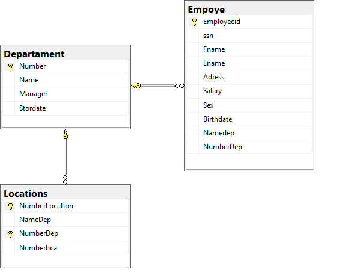

```
-- Crear la base de datos
CREATE DATABASE EmpresaDB;
GO

-- Seleccionar la base de datos
USE EmpresaDB;
GO

-- Crear la tabla: Empoye (Empleado)
CREATE TABLE Empoye (
    Employeeid INT IDENTITY(1,1) NOT NULL,
    ssn VARCHAR(20) NOT NULL,
    Fname VARCHAR(50) NOT NULL,
    Lname VARCHAR(50) NOT NULL,
    Adress VARCHAR(150) NULL,
    Salary DECIMAL(10,2) NOT NULL,
    Sex CHAR(1) NULL,
    Birthdate DATE NULL,
    Namedep VARCHAR(50) NULL,
    NumberDep INT NULL,
    
    CONSTRAINT PK_Empoye PRIMARY KEY (Employeeid),
    CONSTRAINT UQ_Empoye_ssn UNIQUE (ssn)
);
GO

--  Crear la tabla: Departament
CREATE TABLE Departament (
    Number INT IDENTITY(1,1) NOT NULL,
    Name VARCHAR(50) NOT NULL,
    Manager INT NULL, -- FK UNIQUE hacia Empoye (relación 1:1 de jefatura)
    Stordate DATE NULL,
    
    CONSTRAINT PK_Departament PRIMARY KEY (Number),
    CONSTRAINT UQ_Departament_Name UNIQUE (Name),
    CONSTRAINT UQ_Departament_Manager UNIQUE (Manager)
);
GO

-- Agregar la clave foránea de Empoye a Departament (ahora que ambas existen)
ALTER TABLE Empoye
ADD CONSTRAINT FK_Empoye_Departament FOREIGN KEY (NumberDep) 
    REFERENCES Departament(Number)
    ON DELETE SET NULL
    ON UPDATE CASCADE;
GO

ALTER TABLE Departament
ADD CONSTRAINT FK_Departament_Manager FOREIGN KEY (Manager) 
    REFERENCES Empoye(Employeeid)
    ON DELETE SET NULL
    ON UPDATE CASCADE;
GO

-- Crear la tabla: Locations (Ubicaciones del departamento - Relación 1:N)
CREATE TABLE Locations (
    NumberLocation INT IDENTITY(1,1) NOT NULL,
    NameDep VARCHAR(50) NULL,
    NumberDep INT NOT NULL,
    Numberbca INT NULL,
    
    CONSTRAINT PK_Locations PRIMARY KEY (NumberLocation, NumberDep),
    CONSTRAINT FK_Locations_Departament FOREIGN KEY (NumberDep) 
        REFERENCES Departament(Number)
        ON DELETE CASCADE
        ON UPDATE CASCADE
);
GO

-- Crear la tabla: Project (Proyectos)
CREATE TABLE Project (
    Number INT IDENTITY(1,1) NOT NULL,
    Name VARCHAR(100) NOT NULL,
    Location VARCHAR(100) NULL,
    nameDep VARCHAR(50) NULL,
    numberDep INT NOT NULL,
    
    CONSTRAINT PK_Project PRIMARY KEY (Number),
    CONSTRAINT FK_Project_Departament FOREIGN KEY (numberDep) 
        REFERENCES Departament(Number)
        ON DELETE CASCADE
        ON UPDATE CASCADE
);
GO

-- Crear la tabla intermedia: Works_on (Empleado trabaja en Proyecto - Relación M:N)
CREATE TABLE Works_on (
    ssn VARCHAR(20) NOT NULL,
    Nameproject VARCHAR(100) NULL,
    Numberproject INT NOT NULL,
    Hours DECIMAL(5,2) NOT NULL,
    
    CONSTRAINT PK_Works_on PRIMARY KEY (ssn, Numberproject),
    CONSTRAINT FK_Works_on_Empoye FOREIGN KEY (ssn) 
        REFERENCES Empoye(ssn)
        ON DELETE CASCADE
        ON UPDATE CASCADE,
    CONSTRAINT FK_Works_on_Project FOREIGN KEY (Numberproject) 
        REFERENCES Project(Number)
        ON DELETE CASCADE
        ON UPDATE CASCADE
);
GO

--  Crear la tabla: Dependent (Dependientes/Familiares - Entidad débil)
CREATE TABLE Dependent (
    Name VARCHAR(50) NOT NULL,
    ssn VARCHAR(20) NOT NULL,
    sex CHAR(1) NULL,
    Birthdate DATE NULL,
    Relationship VARCHAR(50) NULL,
    
    CONSTRAINT PK_Dependent PRIMARY KEY (Name, ssn),
    CONSTRAINT FK_Dependent_Empoye FOREIGN KEY (ssn) 
        REFERENCES Empoye(ssn)
        ON DELETE CASCADE
        ON UPDATE CASCADE
);
GO
```
## Diagrama final
