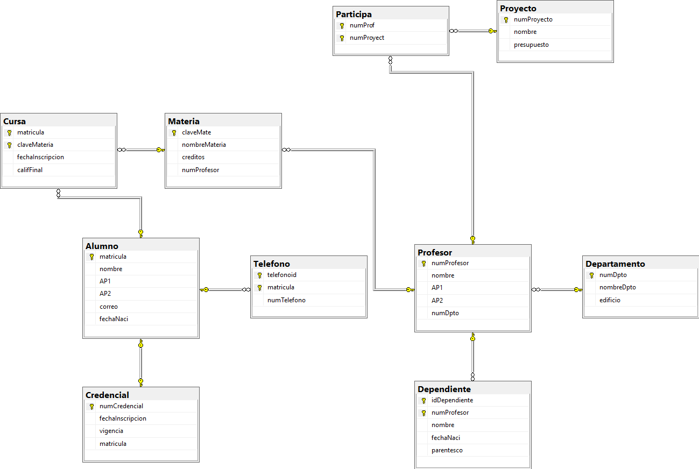

```
-- Crear la base de datos
CREATE DATABASE SistemaUniversidad;
GO

-- Seleccionar la base de datos
USE SistemaUniversidad;
GO

-- Crear la tabla: Departamento
CREATE TABLE Departamento (
    numDpto INT IDENTITY(1,1) NOT NULL,
    nombreDpto VARCHAR(100) NOT NULL,
    edificio VARCHAR(50) NULL,
    
    CONSTRAINT PK_Departamento PRIMARY KEY (numDpto)
);
GO

--  Crear la tabla: Profesor
CREATE TABLE Profesor (
    numProfesor INT IDENTITY(1,1) NOT NULL,
    nombre VARCHAR(50) NOT NULL,
    AP1 VARCHAR(50) NOT NULL,
    AP2 VARCHAR(50) NULL,
    numDpto INT NOT NULL,
    
    CONSTRAINT PK_Profesor PRIMARY KEY (numProfesor),
    CONSTRAINT FK_Profesor_Departamento FOREIGN KEY (numDpto) 
        REFERENCES Departamento(numDpto)
        ON DELETE CASCADE
        ON UPDATE CASCADE
);
GO

-- Crear la tabla: Alumno
CREATE TABLE Alumno (
    matricula VARCHAR(20) NOT NULL,
    nombre VARCHAR(50) NOT NULL,
    AP1 VARCHAR(50) NOT NULL,
    AP2 VARCHAR(50) NULL,
    correo VARCHAR(100) NOT NULL,
    fechaNaci DATE NOT NULL,
    
    CONSTRAINT PK_Alumno PRIMARY KEY (matricula),
    CONSTRAINT UQ_Alumno_correo UNIQUE (correo)
);
GO

-- Crear la tabla: Telefono (Atributo multivaluado de Alumno)
CREATE TABLE Telefono (
    telefonoid INT IDENTITY(1,1) NOT NULL,
    matricula VARCHAR(20) NOT NULL,
    numTelefono VARCHAR(15) NOT NULL,
    
    CONSTRAINT PK_Telefono PRIMARY KEY (telefonoid, matricula),
    CONSTRAINT FK_Telefono_Alumno FOREIGN KEY (matricula) 
        REFERENCES Alumno(matricula)
        ON DELETE CASCADE
        ON UPDATE CASCADE
);
GO

-- Crear la tabla: Credencial (Relación 1:1 con Alumno)
CREATE TABLE Credencial (
    numCredencial INT IDENTITY(1,1) NOT NULL,
    fechaInscripcion DATE NOT NULL DEFAULT GETDATE(),
    vigencia DATE NOT NULL,
    matricula VARCHAR(20) NOT NULL,
    
    CONSTRAINT PK_Credencial PRIMARY KEY (numCredencial),
    CONSTRAINT FK_Credencial_Alumno FOREIGN KEY (matricula) 
        REFERENCES Alumno(matricula)
        ON DELETE CASCADE
        ON UPDATE CASCADE,
    -- Garantiza la relación 1 a 1
    CONSTRAINT UQ_Credencial_matricula UNIQUE (matricula)
);
GO

-- Crear la tabla: Materia (Relación 1:N con Profesor)
CREATE TABLE Materia (
    claveMate INT IDENTITY(1,1) NOT NULL,
    nombreMateria VARCHAR(100) NOT NULL,
    creditos INT NOT NULL,
    numProfesor INT NOT NULL,
    
    CONSTRAINT PK_Materia PRIMARY KEY (claveMate),
    CONSTRAINT FK_Materia_Profesor FOREIGN KEY (numProfesor) 
        REFERENCES Profesor(numProfesor)
        ON DELETE CASCADE
        ON UPDATE CASCADE
);
GO

-- Crear la tabla: Cursa (Relación M:N entre Alumno y Materia)
CREATE TABLE Cursa (
    matricula VARCHAR(20) NOT NULL,
    claveMateria INT NOT NULL,
    fechaInscripcion DATE NOT NULL DEFAULT GETDATE(),
    califFinal DECIMAL(4,2) NULL,
    
    CONSTRAINT PK_Cursa PRIMARY KEY (matricula, claveMateria),
    CONSTRAINT FK_Cursa_Alumno FOREIGN KEY (matricula) 
        REFERENCES Alumno(matricula)
        ON DELETE CASCADE
        ON UPDATE CASCADE,
    CONSTRAINT FK_Cursa_Materia FOREIGN KEY (claveMateria) 
        REFERENCES Materia(claveMate)
        ON DELETE CASCADE
        ON UPDATE CASCADE
);
GO

-- Crear la tabla: Dependiente (Relación 1:N con Profesor)
CREATE TABLE Dependiente (
    idDependiente INT IDENTITY(1,1) NOT NULL,
    numProfesor INT NOT NULL,
    nombre VARCHAR(50) NOT NULL,
    fechaNaci DATE NULL,
    parentesco VARCHAR(30) NOT NULL,
    
    CONSTRAINT PK_Dependiente PRIMARY KEY (idDependiente, numProfesor),
    CONSTRAINT FK_Dependiente_Profesor FOREIGN KEY (numProfesor) 
        REFERENCES Profesor(numProfesor)
        ON DELETE CASCADE
        ON UPDATE CASCADE
);
GO

-- Crear la tabla: Proyecto
CREATE TABLE Proyecto (
    numProyecto INT IDENTITY(1,1) NOT NULL,
    nombre VARCHAR(100) NOT NULL,
    presupuesto DECIMAL(12,2) NOT NULL,
    
    CONSTRAINT PK_Proyecto PRIMARY KEY (numProyecto)
);
GO

-- Crear la tabla: Participa (Relación M:N entre Profesor y Proyecto)
CREATE TABLE Participa (
    numProf INT NOT NULL,
    numProyect INT NOT NULL,
    
    CONSTRAINT PK_Participa PRIMARY KEY (numProf, numProyect),
    CONSTRAINT FK_Participa_Profesor FOREIGN KEY (numProf) 
        REFERENCES Profesor(numProfesor)
        ON DELETE CASCADE
        ON UPDATE CASCADE,
    CONSTRAINT FK_Participa_Proyecto FOREIGN KEY (numProyect) 
        REFERENCES Proyecto(numProyecto)
        ON DELETE CASCADE
        ON UPDATE CASCADE
);
GO
```
## Diagrama Final
