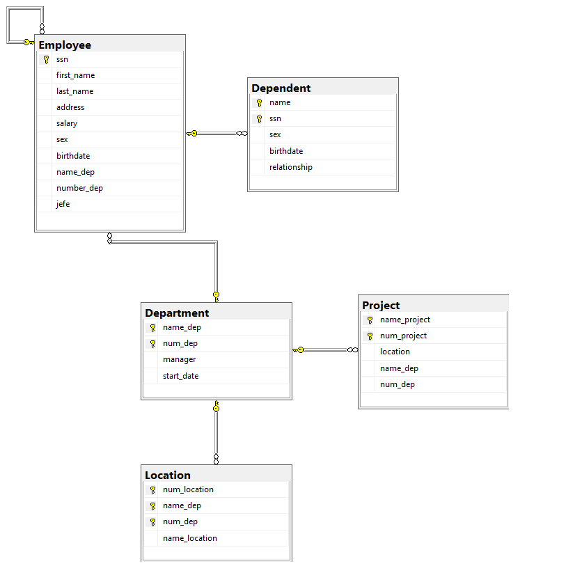

```
-- Crear la base de datos
CREATE DATABASE EmpresaDB_2;
GO

--  Seleccionar la base de datos
USE EmpresaDB_2;
GO

-- Crear la tabla: Department (Clave primaria compuesta: name_dep, num_dep)
CREATE TABLE Department (
    name_dep VARCHAR(50) NOT NULL,
    num_dep INT NOT NULL,
    manager VARCHAR(20) NULL, -- FK UNIQUE hacia Employee (ssn)
    start_date DATE NULL,
    
    CONSTRAINT PK_Department PRIMARY KEY (name_dep, num_dep)
);
GO

-- Crear la tabla: Employee
CREATE TABLE Employee (
    ssn VARCHAR(20) NOT NULL,
    first_name VARCHAR(50) NOT NULL,
    last_name VARCHAR(50) NOT NULL,
    address VARCHAR(150) NULL,
    salary DECIMAL(10,2) NOT NULL,
    sex CHAR(1) NULL,
    birthdate DATE NULL,
    name_dep VARCHAR(50) NULL,
    number_dep INT NULL,
    jefe VARCHAR(20) NULL, -- Autorreferencia a Employee(ssn)
    
    CONSTRAINT PK_Employee PRIMARY KEY (ssn),
    
    -- Clave foránea para la autorreferencia (Jefe)
    CONSTRAINT FK_Employee_Jefe FOREIGN KEY (jefe) 
        REFERENCES Employee(ssn),
        
    -- Clave foránea compuesta hacia Department
    CONSTRAINT FK_Employee_Department FOREIGN KEY (name_dep, number_dep) 
        REFERENCES Department(name_dep, num_dep)
        ON DELETE SET NULL
        ON UPDATE CASCADE
);
GO

-- Agregar la clave foránea del Manager en Department (ahora que Employee ya existe)
ALTER TABLE Department
ADD CONSTRAINT FK_Department_Manager FOREIGN KEY (manager) 
    REFERENCES Employee(ssn)
    ON DELETE SET NULL
    ON UPDATE CASCADE,
    
    -- Garantiza que un empleado solo administre un departamento (1:1)
    CONSTRAINT UQ_Department_Manager UNIQUE (manager);
GO

-- Crear la tabla: Location (Relación 1:N con Department)
CREATE TABLE Location (
    num_location INT IDENTITY(1,1) NOT NULL,
    name_dep VARCHAR(50) NOT NULL,
    num_dep INT NOT NULL,
    name_location VARCHAR(100) NOT NULL,
    
    CONSTRAINT PK_Location PRIMARY KEY (num_location, name_dep, num_dep),
    CONSTRAINT FK_Location_Department FOREIGN KEY (name_dep, num_dep) 
        REFERENCES Department(name_dep, num_dep)
        ON DELETE CASCADE
        ON UPDATE CASCADE
);
GO

-- Crear la tabla: Project (Relación 1:N con Department)
CREATE TABLE Project (
    name_project VARCHAR(100) NOT NULL,
    num_project INT NOT NULL,
    location VARCHAR(100) NULL,
    name_dep VARCHAR(50) NOT NULL,
    num_dep INT NOT NULL,
    
    CONSTRAINT PK_Project PRIMARY KEY (name_project, num_project),
    CONSTRAINT FK_Project_Department FOREIGN KEY (name_dep, num_dep) 
        REFERENCES Department(name_dep, num_dep)
        ON DELETE CASCADE
        ON UPDATE CASCADE
);
GO

-- Crear la tabla intermedia: Work_on (Relación M:N entre Employee y Project)
CREATE TABLE Work_on (
    ssn VARCHAR(20) NOT NULL,
    name_project VARCHAR(100) NOT NULL,
    num_project INT NOT NULL,
    hours DECIMAL(5,2) NOT NULL DEFAULT 0.0,
    
    CONSTRAINT PK_Work_on PRIMARY KEY (ssn, name_project, num_project),
    CONSTRAINT FK_Work_on_Employee FOREIGN KEY (ssn) 
        REFERENCES Employee(ssn)
        ON DELETE CASCADE
        ON UPDATE CASCADE,
    CONSTRAINT FK_Work_on_Project FOREIGN KEY (name_project, num_project) 
        REFERENCES Project(name_project, num_project)
        ON DELETE CASCADE
        ON UPDATE CASCADE
);
GO

-- Crear la tabla: Dependent (Entidad débil con Employee)
CREATE TABLE Dependent (
    name VARCHAR(50) NOT NULL,
    ssn VARCHAR(20) NOT NULL,
    sex CHAR(1) NULL,
    birthdate DATE NULL,
    relationship VARCHAR(50) NULL,
    
    CONSTRAINT PK_Dependent PRIMARY KEY (name, ssn),
    CONSTRAINT FK_Dependent_Employee FOREIGN KEY (ssn) 
        REFERENCES Employee(ssn)
        ON DELETE CASCADE
        ON UPDATE CASCADE
);
GO
```
## Diagrama final
